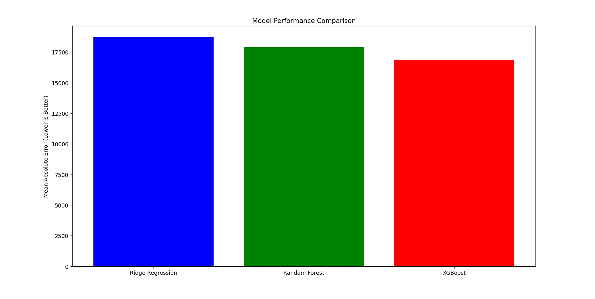

# 🏡 House Price Prediction - Machine Learning Project

## 📌 Project Overview
This project predicts house prices using **machine learning models** based on various house features. The dataset comes from real estate data, and the goal is to build an accurate prediction model.

We compared **three models**:
- **Ridge Regression** (Regularized Linear Regression)
- **Random Forest** (Ensemble of Decision Trees)
- **XGBoost** (Boosted Decision Trees - Best Performer)

## 📊 Model Performance Comparison
We evaluated the models using **Mean Absolute Error (MAE)**, which measures how far the predictions are from actual prices (lower is better).



## 🛠️ Technologies Used
- **Python** 🐍
- **Pandas & NumPy** (Data Processing)
- **Scikit-Learn** (ML Models)
- **XGBoost** (Boosted Trees)
- **Matplotlib** (Visualization)

## 📂 Dataset Details
- `train.csv` - Houses with known sale prices (used for training).
- `test.csv` - Houses with unknown sale prices (used for prediction).
- `sample_submission.csv` - Submission format for predictions.

## 🚀 Project Workflow
1. **Data Cleaning**: Fill missing values & remove unnecessary features.
2. **Feature Engineering**: Convert categorical data using **One-Hot Encoding**.
3. **Model Training & Evaluation**:
   - Ridge Regression (Baseline)
   - Random Forest (Stronger model)
   - XGBoost (Best performer ✅)
4. **Predictions & Submission**: Using XGBoost for final predictions.

## 🏆 Best Model - XGBoost
- **Why XGBoost?**
  - Handles missing values better.
  - Works well with structured/tabular data.
  - Reduces overfitting compared to Random Forest.
  
## 📜 Usage
1. Clone this repo:  
   ```sh
   git clone https://github.com/your-repo/house-price-prediction.git
   cd house-price-prediction
   ```
2. Install dependencies:
   ```sh
   pip install -r requirements.txt
   ```
3. Run the training script:
   ```sh
   python house_price_prediction.py
   ```
4. Get your predictions in `house_price_predictions.csv` 🎯

## 🤝 Contributing
Feel free to open issues or submit PRs to improve this project!

## 📜 License
This project is **open-source** under the MIT License.

